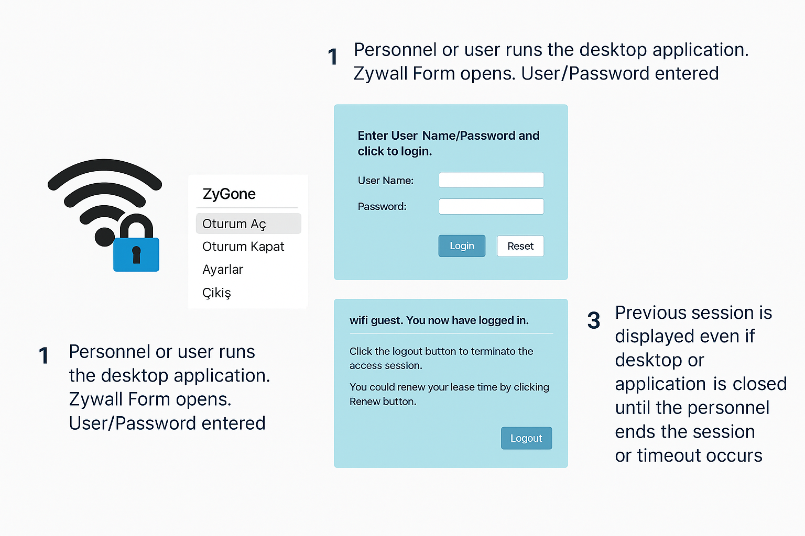

# ZyGone

**ZyGone**, captive portal kullanan ağlarda (özellikle ZyXEL USG cihazları üzerinde), kullanıcıların Wi-Fi oturumlarını daha kolay başlatmalarını ve yönetmelerini sağlayan bir masaüstü uygulamasıdır.

---

## 🎯 Amaç

ZyGone uygulaması şu amaçlarla geliştirilmiştir:

- Kullanıcı adı ve şifre girerek Wi-Fi oturumu başlatmayı kolaylaştırmak  
- Oturum süresi ve durumu hakkında kullanıcıyı bilgilendirmek  
- Tarayıcı kapansa bile oturumun kontrolünü sürdürebilmek  
- Oturumu manuel olarak kapatma (logout) imkânı sunmak  
- IT ekiplerinin müdahalesine gerek kalmadan kullanıcıların kendi oturumlarını sonlandırabilmesi

---

## 🔧 Özellikler

- Sistem tepsisine yerleşen sade arayüz
- Oturum Aç / Oturum Kapat seçenekleri
- Otomatik oturum durumu algılama
- Süreli oturum bildirim desteği (opsiyonel)
- Uygulama kapansa bile session aktif kalır
- Yönetici logout işlemiyle uyumlu

---

## 🖥️ Uygulama Akışı

| Adım | Açıklama |
|------|----------|
| 1️⃣ | Kullanıcı ZyGone uygulamasını çalıştırır ve "Oturum Aç" seçeneğini tıklar. |
| 2️⃣ | ZyWALL giriş formu açılır. Kullanıcı adı ve parola girilir. |
| 3️⃣ | Giriş başarılı olursa oturum süresi ve kalan zaman görüntülenir. |
| 4️⃣ | Uygulama veya bilgisayar kapansa bile session görünmeye devam eder. |
| 5️⃣ | Kullanıcı isterse "Oturum Kapat" ile manuel logout yapabilir. |

---

## 📌 Hedef Kullanıcılar

- Kurumsal ofis kullanıcıları
- Ziyaretçi Wi-Fi kullanıcıları
- Sistem yöneticileri ve teknik ekipler

---

## 📦 Kurulum

> ⚠️ Şu anda test aşamasında, kurulabilir versiyon için `Releases` sekmesine bakınız.

1. Uygulamayı indirin
2. Sistem tepsisine yerleşecektir
3. Sağ tıklayarak “Oturum Aç” veya “Oturum Kapat” işlemini yapabilirsiniz

---

## 📁 Yapılacaklar (To-Do)

- [ ] Otomatik yeniden bağlantı
- [ ] Uyarı sistemi (süre dolmadan önce bilgilendirme)
- [ ] Çoklu kullanıcı desteği
- [ ] Proxy üzerinden giriş desteği

---

## 📄 Lisans

MIT License

---

**ZyGone – Ağınıza bağlı, kontrol sizde.**

